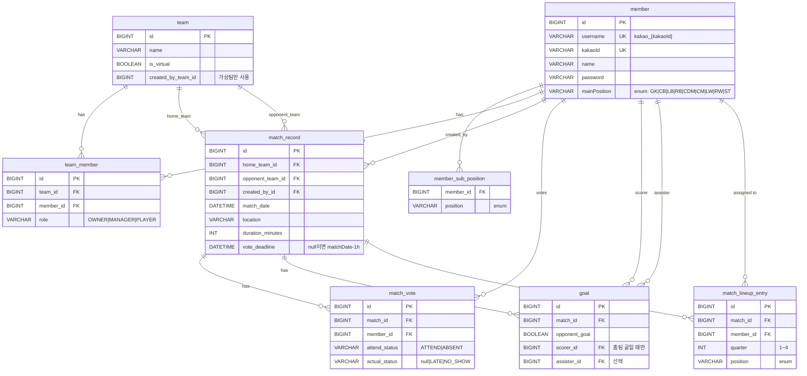

# 조축허브 ERD

> **렌더링 방법**
> - VS Code: `Markdown Preview Mermaid Support` 확장 설치 후 미리보기
> - 웹: [https://mermaid.live](https://mermaid.live) 에 아래 코드블록 내용 붙여넣기

---

---

## 테이블 요약

| 테이블 | 설명 |
|---|---|
| `member` | 회원 (카카오 연동) |
| `member_sub_position` | 부포지션 (최대 3개, 별도 컬렉션 테이블) |
| `team` | 실제 팀 + 가상 팀 |
| `team_member` | 팀-회원 N:M 연결, 역할 포함 |
| `match_record` | 경기 정보 (홈팀 vs 상대팀) |
| `match_vote` | 경기별 출석 투표, unique(match_id, member_id) |
| `goal` | 골 기록, 홈/상대팀 구분 |
| `match_lineup_entry` | 쿼터별 라인업 배정 |
